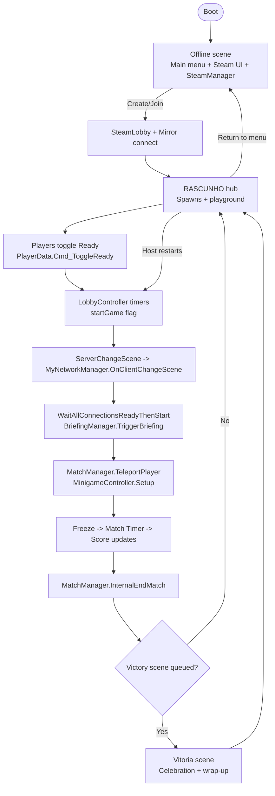
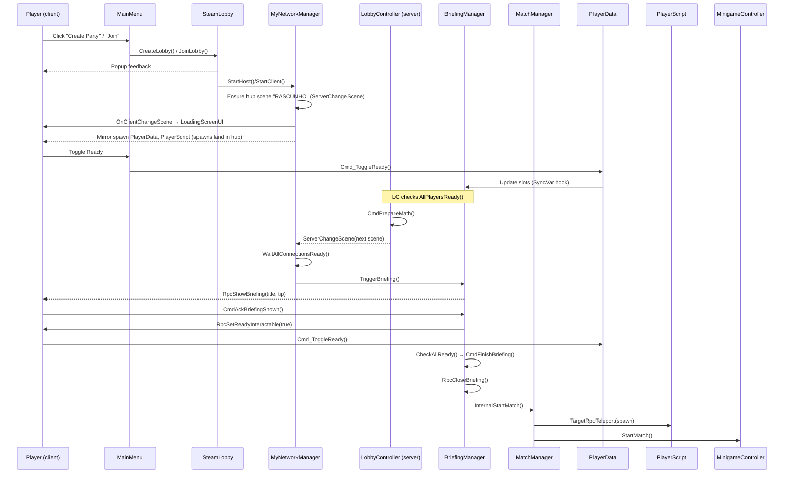
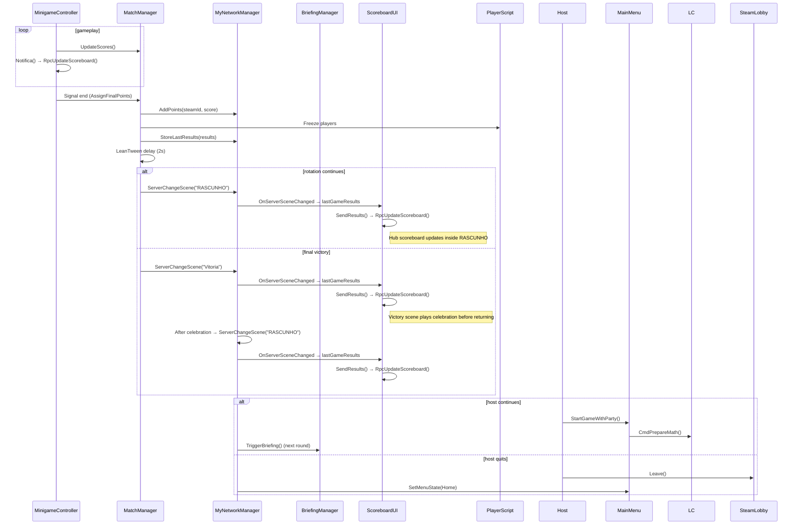

# Multiplayer flow & scene guardrails

## Overview

- **Goal:** describe how players move from boot → offline menu → hub → matchmaking → loading → spawn → minigame loop → victory/results → back to hub.
- **Network stack:** Mirror + FizzySteamworks/KCP transports with Steam lobbies. Core singletons (`MyNetworkManager`, `PlayerList`, `LoadingScreenUI`) survive scene changes via `DontDestroyOnLoad`.
- **Key scenes (build order):** `Offline` (main menu + Steam bootstrap) → `RASCUNHO` (playground hub + scoreboard) → rotating `MN_*` minigame scenes → optional `Vitoria` (victory wrap-up) → back to `RASCUNHO`. `LoadingScene` provides a fallback local loader for non-network transitions. The legacy `PreSteam` scene exists in the project but is not part of the active flow.
- **High-risk areas:** missing references on key prefabs (e.g. `MinigameCatalog` in `MyNetworkManager`, missing `BriefingManager` in minigames), inconsistent spawn lists in `MatchManager`, unassigned UI prefabs in `BriefingManager`/`ScoreboardUI`, or scenes without `PlayerList` present (colour pool resets).

## Lifecycle map

## Stage breakdown

- **Offline startup:** When the `Offline` scene loads, `SteamManager` registers and `MyNetworkManager.Awake` ensures a single persistent manager while building the minigame rotation from `MinigameCatalog`.
- **Offline menu & matchmaking:** The `Offline` scene hosts the `MainMenu` UI alongside `SteamLobby`. Creating or joining a lobby calls `MyNetworkManager.StartHost/StartClient`, swaps the UI state (`MainMenu.SetMenuState`), and transitions the session to the networked hub.
- **RASCUNHO hub & ready gate:** `RASCUNHO` is the first multiplayer scene after matchmaking. `PlayerData` spawns land here, players can free-roam, and `PlayerList.AtivarPlayer(true)` freezes/unfreezes controllers during ready checks. `PlayerData.Cmd_ToggleReady` updates SyncVars that `BriefingManager` mirrors in the hub slots; once everyone has acknowledged the briefing, `LobbyController` starts countdowns from this scene.
- **Scene load handshake:** `LobbyController.ChangeToRandomMinigame` calls `ServerChangeScene` using the rotation built by `MyNetworkManager`. Clients see `LoadingScreenUI` (hooked via `OnClientChangeScene`). Once Mirror reports every connection `isReady`, `BriefingManager.TriggerBriefing` shows the per-round overlay and runs `CmdAckBriefingShown` → `RpcSetReadyInteractable(true)`.
- **Gameplay loop:** `MatchManager` starts with a freeze window (configured via `Database.serverFreezeDuration`) and a match timer (`SettingsMiniGameData.miniGameDuration`). Each `MinigameController` subclass updates live scores, binds scene-specific interactors (checkpoints, courier zones, glass tiles, etc.) and calls `AssignFinalPoints` on finish.
- **Results & rotation:** `MatchManager.InternalEndMatch` persists points in `MyNetworkManager.pointsBoard`/`scoreboard`, freezes players, and after a delay loads `RASCUNHO` so everyone returns to the hub/scoreboard. `ScoreboardUI` pulls `MyNetworkManager.lastGameResults` (or live scores) and rebuilds UI slots in the same scene. When the host restarts (`MainMenu.StartGame` or `PlayerScript` shortcut), the next countdown fires from `RASCUNHO`; leaving the party returns clients to `Offline`. The victory scene defined in `MinigameCatalog.VictorySceneIdentifier` is appended to the rotation and, once shown, flows back into `RASCUNHO` to keep the hub consistent.

## Core flow scripts

| Script | Responsibility | Events consumed/emitted | Scene/asset dependencies | Coupling risks |
| --- | --- | --- | --- | --- |
| `MyNetworkManager` | Extends Mirror `NetworkManager`; keeps client list, scoreboard, minigame rotation, and loading telemetry. | Mirror hooks (`OnServerAddPlayer`, `OnServerSceneChanged`, `OnClientChangeScene`); custom events (`onClientsChanged`, `Notifica`). Calls `BriefingManager.singleton.TriggerBriefing()` and `PlayerList.singleton` helpers. | Serialized `MinigameCatalog`; requires `PlayerList` & `BriefingManager` singletons in runtime scenes; optional `LoadingScreenUI` prefab. | Null singletons when scenes omit managers; `_sceneRotation` empty if catalog missing; scoreboard drift if `RegisterNewPlayer` not called. |
| `SteamLobby` | Wraps Steamworks lobby creation/join + matchmaking, binds to Mirror start/stop. | Steam callbacks (`LobbyCreated`, `LobbyEnter`, etc.); calls `MyNetworkManager.StartHost/Client`, `PopupManager`. | `SteamManager` subsystem; `MainMenu`, `PopupManager`. | Running outside Steam → callbacks null; forgetting to set `HOST_ADDRESS_KEY` breaks clients. |
| `MainMenu` | UI brain for menu/party screens, ready button, host/client/dev shortcuts. | Button events; uses `MainMenu.instance`, `SteamLobby`, `LobbyController`, `PlayerData.ToggleReady`. | UI prefabs for home/party; ready button references; component lives in the `Offline` scene. | Requires `MainMenu.instance` to exist before other scripts access; toggles assume `NetworkClient.active`. |
| `PlayerData` | Per-player Mirror identity (Steam info, color, ready). Syncs scoreboard entries via MyNetworkManager. | Commands: `CmdSetPlayerInfo`, `CmdRequestColor`, `Cmd_ToggleReady`, `CmdReportLoadProgress`. Hooks update UI via UnityEvents. | `PlayerList.singleton`, `PlayerDataSO`, `Database`, `CharacterSkinHandler`, `BriefingManager`. | Needs `SteamManager.Initialized`; color pool desync if `PlayerList` unavailable; scoreboard assumes `pointsBoard` entry. |
| `PlayerList` | Server-side registry of `PlayerData` and available colours; freezes players on demand. | Mirror SyncLists; listens to `SceneManager.sceneLoaded`. | Serialized `Database` with color palette. | Must exist in first scene; `ColorsAvailable` empty if `Database` misconfigured. |
| `LobbyController` | Server authority on countdown timers and switching to the next minigame. | Commands `CmdPrepareMath`, `CmdStartMath`; updates timers via SyncVars hooks (`HUDSO`). | Serialized `Database`, `HUDSO`. | `MyNetworkManager.SceneRotation` must be populated; timers rely on server `Update` (scene must stay active). |
| `BriefingManager` | Controls pre-round overlay, ready slots, readiness gating, and `CmdMarkClientReady`. | SyncVar hooks, Commands (`CmdAckBriefingShown`, `CmdMarkClientReady`), RPCs to show/hide UI. | UI references (`slotPrefab`, Canvas), `BriefingScreenSO`. | Requires spawn in every gameplay scene; missing UI references break ready gating; ack tracking relies on connection IDs staying stable. |
| `MatchManager` | Runs freeze/match timers, teleports players to spawns, collects results, changes scene to results. | Server `Update`; `CmdPrepareMath`; calls `MinigameController.Setup/StartMatch`; uses `LeanTween` for delays. | `_spawns` list populated in scene; `SettingsMiniGameData`, `HUDSO`, `Database` ScriptableObjects. | Without spawn transforms players stack at origin; `scoreRule` resolved via `FindFirstObjectByType` (must exist). |
| `MinigameController` (base) + subclasses (`Race`, `BatataQuente`, `Sumo`, `Memoria`, `Queda`, `Glass`, `Street`, `Soccer`) | Implements per-minigame scoring/state, notifies scoreboard, awards points. | Calls `OnMatchStarted/Ended`, `Notifica`, `RpcUpdateScoreboard`. Subclasses bind triggers, timers, respawns. | Scene-specific components: e.g. `RaceCheckpoint`, `SlotRoleta`, `HideStep`, `GlassTile`, `StreetCourierZone`, `GoalTrigger`, `BallPhysics`. | Missing scene bindings cause runtime nulls (many use `FindAnyObjectByType` fallback). Need consistent net identities on triggers for server callbacks. |
| `PlayerScript` | Local player controller (movement, input, ready hotkeys, respawn RPCs). | Commands (`CmdDeath`), TargetRPCs (`TargetRpcTeleport`), interacts with `HUDSO`, `BriefingManager`, `MainMenu`. | Serialised references: `Database`, `PlayerControlsSO`, `SmoothSyncMirror`, UI prefabs for pause phone. | Freeze/ready gating depends on `BriefingManager`; teleport requires `_smoothSyncMirror`. |
| `LoadingScreenUI` | Centralized loading overlay for local and Mirror scene changes with telemetry pulses. | Called by `MyNetworkManager.OnClientChangeScene`, `SteamLobby.Leave`, `LoadNewScene`. | Panel/slider/TMP references or auto-instantiated overlay. | Must be in boot scene or spawned via `Ensure()` before first load. |
| `ScoreboardUI` | Reads results from `MinigameController`/`MyNetworkManager` and builds ranking UI. | Observes `ISubject` notifications & `RpcUpdateScoreboard`. | `slotPrefab`, `slotsParent`, `Database`. | Needs scoreboard prefab in results scene; missing `Database` breaks colours. |

## Mirror messages & RPC inventory

| Message | Type | Direction | Payload | Triggered by | Notes |
| --- | --- | --- | --- | --- | --- |
| `PlayerData.CmdSetPlayerInfo` | Command | Client → Server | Steam name + ID | `PlayerData.InitializePlayerInfo()` on local start | Seeds `pointsBoard`; requires Steam to be initialised. |
| `PlayerData.Cmd_ToggleReady` | Command | Client → Server | none (toggles SyncVar) | `MainMenu.ToggleReady`, `PlayerScript` hotkey | Kicks `BriefingManager.CheckAllReady`; blocked until `ReadyInteractableClient` true. |
| `PlayerData.CmdRequestColor` | Command | Client → Server | Colour index | UI colour picker | Calls `PlayerList.ServerRequestColor`. |
| `PlayerData.CmdReportLoadProgress` | Command | Client → Server | Scene name + progress (0..1) | `LoadingScreen` reporter | Feeds `_clientLoadProgress` telemetry in `MyNetworkManager`. |
| `BriefingManager.CmdAckBriefingShown` | Command | Client → Server | implicit connId | `RpcShowBriefing` → client ack | Unlocks ready button once all clients have acked. |
| `BriefingManager.CmdMarkClientReady` | Command | Client → Server | n/a | Briefing UI "Ready" button | Forces `PlayerData.IsReady = true` server-side even if SyncVar toggle blocked. |
| `BriefingManager.CmdFinishBriefing` | Command | Client/ServerOnly | n/a | Host closing briefing | Sets `briefingStarted` flag. |
| `BriefingManager.RpcShowBriefing/CloseBriefing/SetReadyInteractable` | ClientRpc | Server → All | UI data (title, tip, bool) | `TriggerBriefing`, `CmdMarkClientReady` | Controls overlay visibility & interactivity. |
| `LobbyController.CmdPrepareMath` | Command | Client (host) → Server | none | Host pressing start / auto-start | Starts pre-match timer. |
| `LobbyController.CmdStartMath` | Command | Client (host) → Server | none | Dev start or auto fallback | Starts immediate countdown. |
| `MatchManager.CmdPrepareMath` | Command | Client (host) → Server | none | Exposed but currently unused in flow | Delegates to `InternalPrepareMath`. |
| `MatchManager.TeleportPlayer` → `PlayerScript.TargetRpcTeleport` | TargetRpc | Server → specific client | Position + rotation | After freeze delay | Resets movement & syncs SmoothSync. |
| `PlayerScript.CmdDeath` | Command | Client → Server | none | `InternalDeath(false)` | Broadcasts death via `RpcOnDeath`. |
| `MinigameController.RpcUpdateScoreboard` | ClientRpc | Server → All | arrays of names/points/colours | Called whenever scores change | `ScoreboardUI` listens and rebuilds UI. |
| `SoccerMinigameController.RpcUpdateSoccerScore/ShowGoal/Toast` | ClientRpc | Server → All | ints/strings | Goals scored | Update HUD and feed chat toasts. |
| `BatataQuenteMinigameController.RpcShowRoulette/UpdateTimer/...` | ClientRpc | Server → All | freeze durations, holder IDs | Selection & timer events | Drives UI animation; ensure UI prefab exists. |

## Decision points & ownership

- **Who starts matches?** Host client via `LobbyController.CmdPrepareMath/CmdStartMath`. Requires `MyNetworkManager.startGame` (for dev skip) or all ready.
- **Ready checks:** Each player toggles `IsReady`; server-side `BriefingManager.CmdMarkClientReady` ensures final readiness only after every client has acked the briefing overlay.
- **Input locking:** During briefing/selection, `PlayerList.AtivarPlayer(true)` freezes all player controllers; `BriefingManager.RpcSetReadyInteractable` gates UI. Individual minigames may freeze again (e.g. BatataQuente selection `FreezeAll`).
- **Scene rotation:** `MyNetworkManager.AdvanceScenePointer` decides next minigame; victory scene appended automatically. Removing/adding minigames uses `_activeMinigameIds` list.
- **Round termination:** `MatchManager.InternalEndMatch`, `MinigameController.AssignFinalPoints`, or minigame-specific triggers (e.g. `ChegadaPodio` hitting finish line). Some controllers invoke `MatchManager.singleton.SetMatchTimer` or `finalizar` UnityEvents to signal match end.
- **Results exit:** From `RASCUNHO`, host triggers `MainMenu.StartGame` (relays to `LobbyController.StartGameWithParty`) for next round, or leaves lobby via `MainMenu.LeaveParty`/`SteamLobby.Leave`, which returns everyone to the `Offline` scene.

## Sequence diagram – entering a match

## Sequence diagram – round transition

## Telemetry & safeguards

- **Load telemetry:** Clients call `PlayerData.CmdReportLoadProgress`. `MyNetworkManager` logs min/avg/max load percentages with timestamps; ensure UI or monitoring consumes these logs.
- **Scene assertions:** Add `RuntimeInitializeOnLoadMethod` hooks or `OnValidate` checks to ensure every minigame scene contains `MatchManager`, `BriefingManager`, assigned `SettingsMiniGameData`, and fills `MatchManager._spawns`.
- **Singleton health checks:** Consider a lightweight boot diagnostic that verifies `MyNetworkManager.manager`, `PlayerList.singleton`, `BriefingManager.singleton`, and `LoadingScreenUI.Instance` before starting matchmaking.
- **Colour pool integrity:** `PlayerList.RebuildColorPool` runs on scene loads; ensure every player has a valid colour to prevent range errors in `Database.GetColor`.
- **Scene validation:** Editor tooling under **Tools → Scene Validation** enforces required components in `Offline`, `RASCUNHO`, `MN_*`, and `Vitoria` scenes, lets you tune rules via the **Rule Manager** window, and blocks builds when mandatory managers are missing.

## Scene dependency register

See `docs/architecture/scene_dependencies.csv` for per-scene objects/components required by the runtime scripts above. Maintain the CSV whenever scenes change to avoid silent coupling regressions.
